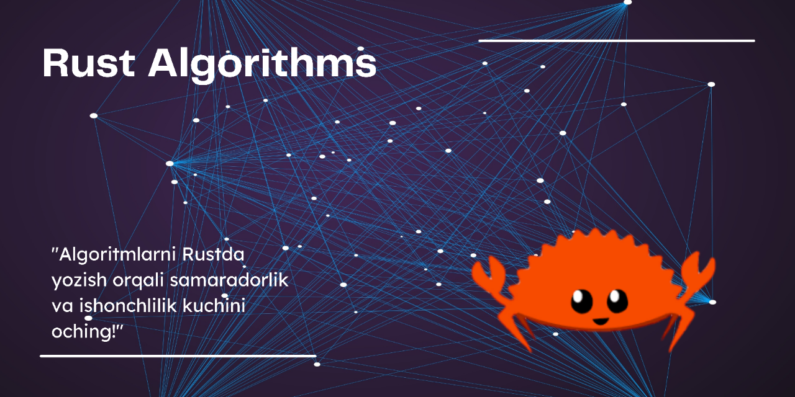

<h2 align="center">DSA with Rust </h2>

<header>

<h1 style="display: inline">Data Structure va Algoritmlarni Rustda yozamiz</h1>

## Darsliklar uchun havolalar:

1. [Big O notation](./01.Big%20O%20notation/big-o-notation.md)
2. [Sonlar](./02.Numbers/Numbers.md)
3. [Searching Algorithms](./03.Searching%20Algorithms/Searching%20Algorithms.md)
4. [Sorting Algorithms](./04.Sorting%20Algorithms/Sorting%20Algorithms.md)
5. [Data Structures](./05.Data%20Structures/Data%20Structures.md)
6. [Linked List](./06.Linked%20List/Linked%20List.md)
7. [Tree](./07.Tree/Tree.md)
8. [Graph](./08.Graph/Graph.md)
9. [Greedy Algorithms](./09.Greedy%20Algorithms/Greedy%20Algorithms.md)
10. [Dynamic Programming](./10.Dynamic%20Programming/Dynamic%20Programming.md)
11. [Other Algorithms](./11.Other%20Algorithms/Other%20Algorithms.md)

> Proyektni contribute qilmoqchi bo'lsangiz, siz uchun doimo pull-request eshiklarimiz ochiq 😉